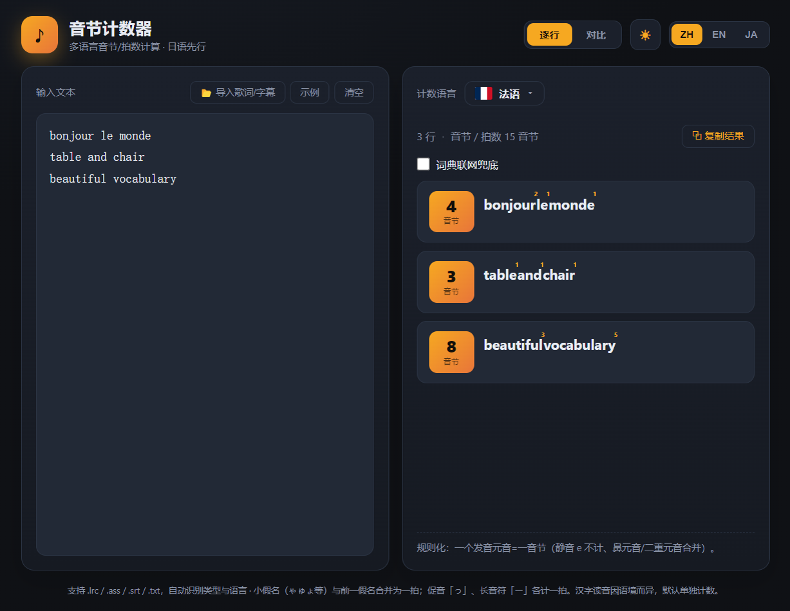

# 音节计数器 · Syllable Counter

多语言歌词/文本的**逐行·逐字音节数（拍数）**计算桌面小工具。纯前端，可打包成 Windows EXE。

日语按唱歌 **mora（拍）** 计算，其余语言按发音音节数精确统计。支持导入常见歌词/字幕文件、日文 vs 中文逐行对比高亮。



## 功能特性

- **逐行 + 逐字**音节/拍数：每行总计 + 每个字/词右上角标注拍数。
- **日语按唱歌 mora**：通过在线注音（[shirabe.dev](https://shirabe.dev)，IPAdic）把汉字转换为假名读音后数拍；离线时自动降级到本地规则。
- **60+ 语言精确计数**：英语（CMU 发音词典）、法语/葡语/西语/意语/德语/希腊语/拉脱维亚语/立陶宛语/蒙古语/亚美尼亚语/威尔士语/爱尔兰语/泰语等均做了规则化；200 项单元测试锁定精确值。
- **歌词/字幕导入**：`.lrc` / `.ass` / `.srt` / `.txt`，自动识别类型与语言；自动剥离 `[mm:ss.xx]` 与 `<mm:ss.xx>` 时间戳（含行内交错多时间戳）。
- **对比视图**：任意两种语言逐行对齐，剔除空白行，**高亮不一致**的行，可复制单行或全部结果。
- **可搜索的两级分组语言选择**：按国家分组 → 方言子层，可按缩写排序、实时搜索，默认普通话。
- **词典联网兜底**：英语/西语走 Datamuse，其他语言走 Wiktionary，查不到时优雅回退本地规则。
- **打包为 EXE**：`@electron/packager` 产出免安装的 Windows 可执行文件。

## 运行环境

- Node.js ≥ 18（开发环境）
- 支持 Windows / macOS / Linux（打包目标为 Windows x64）

## 快速开始

```bash
npm install
npm run build        # 构建前端到 dist/
npx electron .       # 以桌面窗口运行（加载 dist）
```

开发调试（浏览器 + 热更新）：

```bash
npm run dev
```

## 打包成 EXE

```bash
npm run electron:build
```

产物位于 `release/音节计数器-win32-x64/音节计数器.exe`，整个目录拷走即可运行。

## 测试

```bash
npm test
```

包含 200 项计数逻辑断言 + 16 项歌词/字幕解析断言。

## 语言支持（部分）

两级分组：国家 → 方言。默认普通话；方言层不设旗标。

> 英语、西班牙语、法语、葡萄牙语、意大利语、德语、希腊语、拉脱维亚语、立陶宛语、蒙古语、亚美尼亚语、威尔士语、爱尔兰语、泰语、日语（mora）……共 60+ 语言。

## 目录结构

```
mini-tool/
├── src/
│   ├── counter.js          # 计数引擎 + 语言注册表（62 语言规则）
│   ├── lyrics.js           # LRC/ASS/SRT/TXT 解析与时间戳剥离
│   ├── App.vue             # 主界面
│   ├── CompareView.vue     # 对比视图
│   ├── analyzeService.js   # 分析编排
│   └── patterns/en_dict.js # CMU 发音词典（13 万词 → 音节数）
├── electron/
│   ├── main.cjs            # 主进程入口
│   ├── preload.cjs         # 安全桥接
│   └── ipc.cjs             # IPC（在线注音代理、词典兜底）
├── test/                   # 单元测试
├── scripts/capture.cjs     # 离屏截图验证脚本
└── docs/screenshot.png
```

## 鸣谢

- 日语注音：[shirabe.dev](https://shirabe.dev)（IPAdic）
- 英语音节：[CMU Pronouncing Dictionary](http://www.speech.cs.cmu.edu/cgi-bin/cmudict)
- 词典兜底：[Datamuse](https://www.datamuse.com/) / [Wiktionary](https://www.wiktionary.org/)

## 许可

[MIT](LICENSE)
